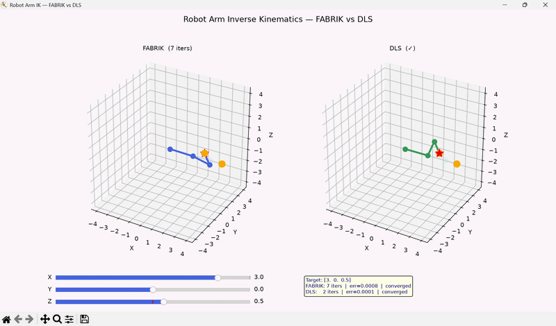

Adaptive λ — large when far from target for fast convergence, small when close for precision.

**DLS random restarts** — if the solver gets stuck in a local minimum, it automatically retries from different random starting configurations.

---

## Controls

| Input | Action |
|---|---|
| X/Y/Z sliders | Move target in 3D space |
| 1–5 | Jump to preset targets |
| R | Reset arm to home position |

---

## Setup

```bash
git clone https://github.com/stuxnet33/inverse-kinematics
cd inverse-kinematics
python -m venv venv
venv\Scripts\activate
pip install matplotlib numpy
python arm.py
```
## Demo


---

## Planned

- Extend to 6-DOF matching the physical EEZYbotARM Mk2 build
- Connect solver output to physical arm via Raspberry Pi and PCA9685
- Add workspace sphere visualisation showing reachable area
- FABRIK with joint angle constraints

---

*Part of a robotics project series. See also:*
*[Path Planning Visualiser](https://github.com/stuxnet33/path-planning-visualiser) · [arXiv Research Tracker](https://github.com/stuxnet33/arxiv-research-tracker) · [Self-Hosted VPN](https://github.com/stuxnet33/self-hosted-vpn)*
